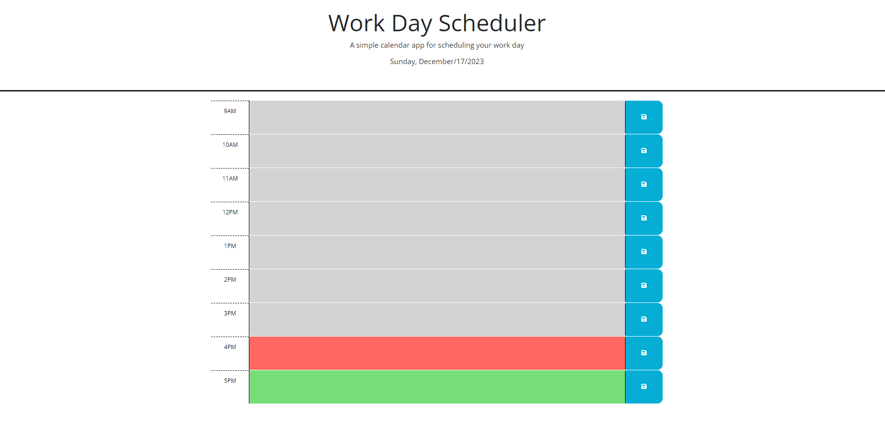

# daily-work-planner
This is a daily work planner that runs 9-5pm. It greys out past hours, makes current hour red, and makes future hours green.

## Description
In this daily planner, you may add your to do items into any of the time boxes and hit the save button on the right side of it. After saving your schedule, it will remain there after refresh/restart. The planner also changes color based on the hour. Grey is for past hours, red is for the current hour, and green is for future hours. 

I am still working on getting the colors to remain grey after 5pm to show past hours and turning green when it is before 9am to show future hours. 

## Technologies Used
HTML, CSS, JavaScript, Local Storage, jQuery, Google Fonts, and dayjs.

## Creditss
I used the following websites to help me build my code:   
[W3 Schools switch statements](https://www.w3schools.com/js/js_switch.asp)   
[mdn Web Docs localStorage](https://developer.mozilla.org/en-US/docs/Web/API/Window/localStorage)   

## Licenses
MIT License